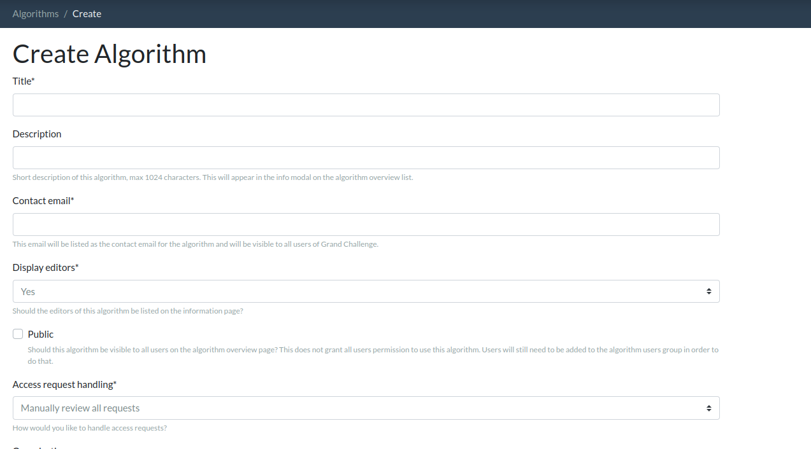
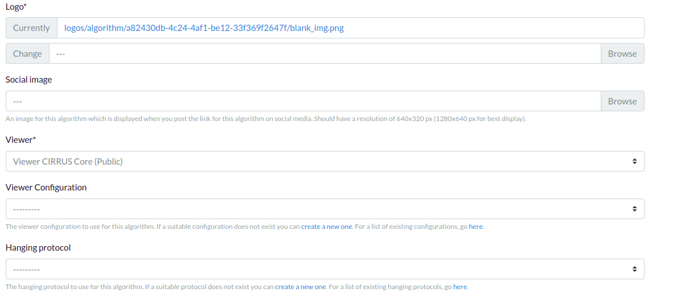
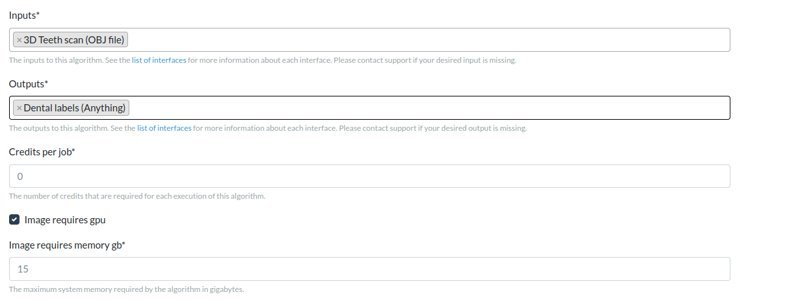
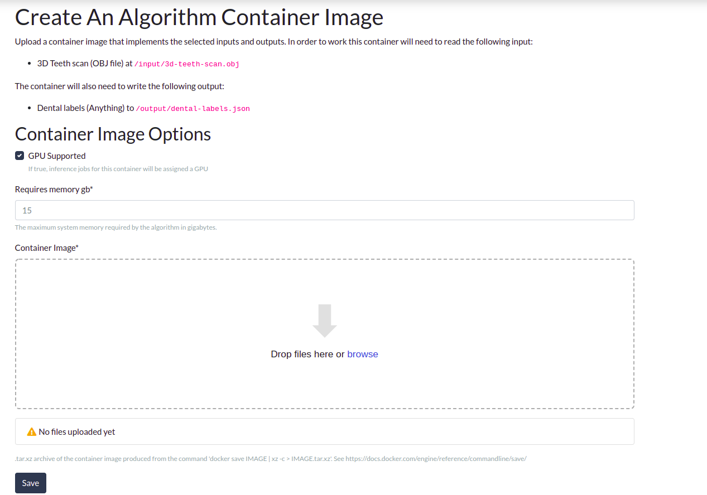
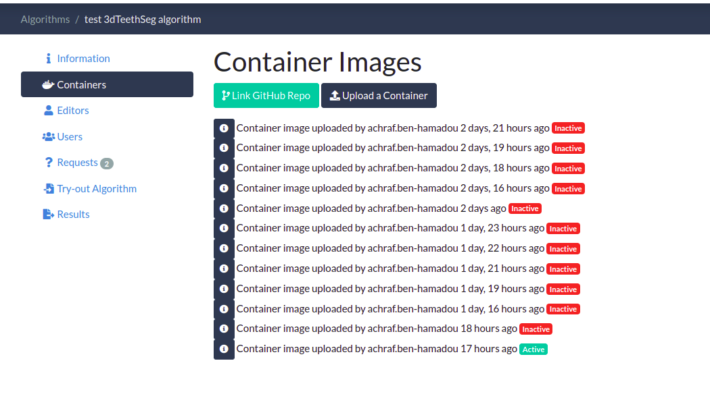

# Docker image of reference algorithm for 3DTeethSeg22 challenge .
Welcome to the 3D_teeth_seg github repository. Here you can find code of our dockerized reference algorithm 
for 3d teeth scan segmentation to use as a template for your algorithm submission.


## Input and Output interfaces
All algorithms submitted to the 3DTeethSeg22 must comply with these input and output interfaces. 

It reads the input as: 
* obj file at "/input/3d-teeth-scan.obj"

and writes the output to :
* json file related to this 3D scan at "/output/dental-labels.json"

Example of output dental-labels.json file (same format as ground-truth json file, e.g. can be found [here](test/0EJBIPTC_lower.json).

Here is a snippets:
```python
{
    "id_patient": "", 
    "jaw": "upper", #or "lower",  extracted  from input
    "labels": [0, 0, 44, 33, 34, 0, 0, 45, 0, .. ,41,  0, 0, 37, 0, 34, 45, 0, 31, 36], 
    # label of each 3D point in FDI format (label 0 correspond to gingiva)
    "instances": [0, 0, 10, 2, 12, 0, 0, 9, 0, 0, .. , 10, 0, 0, 8, 0, 0, 9, 0, 1, 8, 13],
    # each 3D point with same instance correspond only to one tooth
    # all points with the same instance (correpond exactly to one tooth) should have the same label 
    # preferably tooth instance is in [1,2, .. , number_of_tooth_detected] 
    # by default 0 is attributed to gingiva instance
}
```

## Embedding your algorithm into an algorithm docker container

We encourage you to adapt this example to your needs and your 3D teeth segmentation and 
labeling solution. You can modify, remove, or add the the files as needed and
customize your parameters. As discussed above, the main python script to be run by the container is process.py. Please note that we hightlighted the most relevant code parts to be customized with TODO comments.

### Configure the Docker file

We recommend that you use our dockerfile <!-- link to the dockerfile script --> as a template, and update it according to your algorithm 
requirements. There are three main components you need to define in your docker file in order to wrap 
your algorithm in a docker container:

1. Choose the right base image (official base image from the library you need (tensorflow, pytorch etc.) recommended)
```python
FROM pytorch/pytorch:1.9.0-cuda11.1-cudnn8-runtime
```

2. Copy all the files you need to run your model : model weights, *requirements.txt*, all the python files you need etc.

```python
COPY --chown=algorithm:algorithm requirements.txt /opt/algorithm/
COPY --chown=algorithm:algorithm model /opt/algorithm/model
COPY --chown=algorithm:algorithm model.pth /opt/algorithm/checkpoints
```

3. Install all the dependencies, defined in *requirements.txt*, in your dockerfile.
```python
RUN python -m pip install --user -rrequirements.txt
```
Ensure that all of the dependencies with their versions are specified in *requirements.txt*

### Build, test and export container 

1. **Build:** To test if all dependencies are met, you should run the file build.bat (Windows) / build.sh (Linux) to build the docker container. Please note that the next step (testing the container) 
also runs a build, so this step is not mandatory if you are certain 
that everything is set up correctly.

2. **Test:** To ckeck if your docker container works as you expect, you may run locally test.sh/test.bat. But first you need to update the file test/expected_output.json with your expected results (output of your algorithm) for the tested sample test/0EJBIPTC_lower.obj. test.sh/test.bat actually runs your docker image on test/0EJBIPTC_lower.obj, produces /ouput/dental-labels.json, and finally compares it to test/expected_output.json.

    If the test runs successfully you will see the message Tests successfully passed... at the end of the output

3. **Export:** Run export.sh/export.bat to save the docker image to .tar.gz file.

### Submit your algorithm 

**📌 NOTE: Number of allowed submissions by phase:**
- Only **5** submissions to the preliminary Test phase are allowed
- Only **one** submission is allowed for the Final Test phase 

Please make sure all steps described above work as expected before proceeding.
Ensure also that you have an account on grand-challenge.org and that you are a [verified user](https://grand-challenge.org/documentation/account-verification/).
 
Once you checked that your docker container runs as expected, you are ready to submit! Let us walk you through the steps 
you need to follow to upload and submit your algorithm to [3DTeethSeg22](https://3dteethseg.grand-challenge.org/) track:

1. You first have to create an algorithm entry for your docker container [here](https://grand-challenge.org/algorithms/create/).
   * Please choose a title and description for your algorithm and enter the modalities and structure information as in the example below.
   
   * Scrolling down the page, you will see that you need to enter further information like the logo (preferably square image) and the Viwer for example *Viewer CIRRUS Core (Public)*
   
   * For the interfaces of the algorithm, please select *3D Teeth scan (OBJ file)* as Inputs, and *Dental labels (Anything)* as Outputs.
   * Indicate if you would like your Docker image to use GPU and how much memory it needs 
   
   

   * Don't forget to click the Save button at the bottom of the page to create your algorithm.

2. After creating your algorithm, you need to attach a docker container to it so it becomes functional. If you already built the tar.gz file as described above then you can upload this file directly. First choose "Containers" on the left menu of your screen as shown below, then click on "upload a Container" button, and upload your tar.gz file. You can also later overwrite your container by uploading a new one (ie. you should not create a whole new algorithm if you make some code changes):
    Please note that it can take a while until the container becomes active. (Status will change from "Ready: False" to "Active")  Check back later or refresh the URL after some time.
    
    

      
3. Once your algorithm is ready to run you will see the status "Active" beside it as shown below
    

[comment]: <> (    Once it becomes active, we suggest that you try out the algorithm to verify everything works as expected. For this, please click on *Try-out Algorithm* tab, and upload a *Generic Medical Image*. You could upload the image provided here in the test folder since it is a 3D image &#40;CXRs are stacked together&#41; which is the expected format.)

[comment]: <> (  ![alt text]&#40;images/algorithm_tryout.PNG&#41;)

[comment]: <> (   OPTIONAL: You could look at the results of your algorithm: click on the *Results*, and *Open Result in Viewer* to visualize the results. You would be directed to CIRRUS viewer, and the results will be visualized with the predicted bounding boxes on chest x-ray images as below. You could move to the next and previous slice &#40;slice is a chest x-ray in this case&#41; by clicking on the up and down arrow in the keyboard.)

[comment]: <> (     ![alt text]&#40;images/algorithm_results.PNG&#41;)

4. You have created and tested your Grand-Challenge Algorithm!!  The last step is to submit your algorithm to the 3DTeethSeg22 challenge to have it evaluated and get your spot on the leaderboard!
   Go to the [3DTeethSeg22 submission page](https://3dteethseg.grand-challenge.org/evaluation/challenge/submissions/create/), and click on the track where you want to participate
   ("Preliminary Test : 3D Teeth Segmentation and Labeling Submission" OR "Final Test : 3D Teeth Segmentation and Labeling Submission
Create a new submission")

5. You have created and tested your Grand-Challenge Algorithm!! The last step is to submit your algorithm to the 3DTeethSeg22 challenge to have it evaluated and get your spot on the leaderboard! Go to the 3DTeethSeg22 submission page, and click on the track where you want to participate.
Choose your algorithm name from the dropdown list and click on "Save".
6. Allow some time for the evaluation to be processed.  It may not start immediately depending on what hardware resources are available at the time. 
   Your result will appear on the [leaderboard page](https://3dteethseg.grand-challenge.org/evaluation/challenge/leaderboard/) (make sure to select the track where you submitted).
   If you do not see your result after 24 hours please contact us via email, the forum or  and provide your algorithm name and date/time you submitted in Central European Time.
   

### Re-submitting if you make improvements
If you already have an algorithm on Grand-Challenge you do NOT need to make a new one whenever you have made some improvements or changes to your code. 
To re-submit, you can upload a new tar.gz file which will overwrite the old one.  Find your algorithm at [https://grand-challenge.org/algorithms/](https://grand-challenge.org/algorithms/).  Click on "Containers", and "upload a container" as before.  Allow some time for the algorithm to become "Active" as previously. 


Once your algorithm is updated you need to resubmit to 3DTeethSeg22, this does not happen automatically!  Visit the [3DTeethSeg22 submission page](https://3dteethseg.grand-challenge.org/evaluation/challenge/submissions/create/) and proceed to submit to your chosen track as before. 


